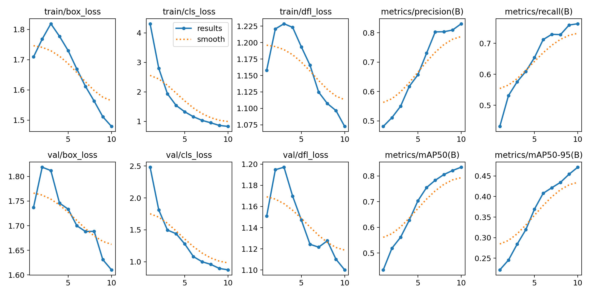
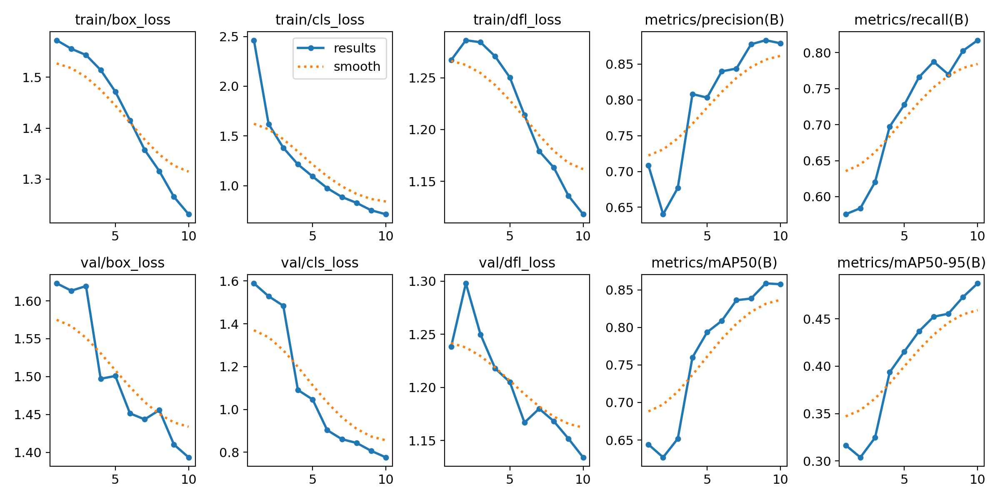
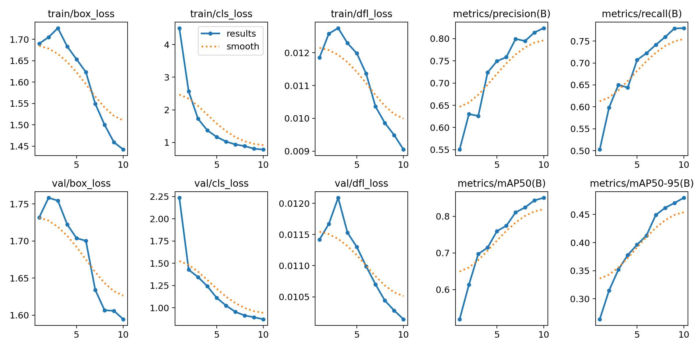

### 1. Мой выбор пал на датасе по детекции персонажей из игры CSGO: 
 - ссылка на датасет: https://huggingface.co/datasets/keremberke/csgo-object-detection
- Рамеры разбиения: train - 3879 изображений, train - 383 изображения, train - 192 изображения.
- Классов 4, по 2 на каждую из двух команд игры: бокс самого персонажа и его головы.
- размер картинок 416 на 416 пикселей.

### 2. Модель я взял YOLOv10 (nano чтоб быстрее училось).
- Отличия по сравнению с предыдущими версиями: Самое классное обновление, это избавление от кастыля в лице NMS. YOLO предыдущих версий используют Non‑Maximum Suppression (NMS) после предсказаний, а в YOLOv10 от него полностью отказались и модель учится выдавать ровно одни бокс на объект, а не кучу. Это достигается за счёт новой структуры детектора и нестандартного обучения с учётом уникальности предсказания. 
- В голове уменьшили количество параметров без потери качества, использованы новые блоки с эффективными свертками (Depthwise Separable, pointwise свертки и другое)
- В функцию потерь добавили компоненту, отвечающую за уникальность предсказания (чтоб не было кучи боксов на один объект). Для каждого объекта находится самое лучшее предсказание, а все остальные штрафуются (это и есть дополнительная компонента лосса). 
- Данные нововведения позволяют добиться: детерминированное время inference,
меньше зависимостей от гиперпараметров,
лучше работает на сценах с плотной упаковкой объектов.

### 2.1 Anchor-free детекция в yolo

- Изображение проходит через backbone, получается карта признаков
- Для каждого пикселя на карте признаков сеть выдаёт:
- **`x`, `y`** — смещение центра бокса от позиции пикселя,
- **`w`, `h`** — ширина и высота бокса,
- **confidence** — вероятность наличия объекта,
- **class probabilities** — вероятности классов.
- На этапе обучения: для каждого истинного объекта выбирается один "ответственный" пиксель на карте признаков (обычно ближайший к центру объекта). Остальных учат предсказывать отсутствие объекта.

### 3. Подготовка данных и обучение модели
- работал в kaggle
- везде 10 эпох обучения
- Модель YOLOv10n (nano), использовал предобученную, примерно 2.7м параметров, качество: Precision=0.8169, Recall=0.7742, mAP50=0.8553, mAP50-95=0.4570. График потерь:

- Модель YOLO11n (nano), использовал предобученную, примерно 2.6м параметров, качество: Precision=0.8760, Recall=0.8429, mAP50=0.8916, mAP50-95=0.4628 График потерь:

- Модель YOLO26n (nano), использовал предобученную, примерно 2.5м параметров, качество: Precision=0.8708, Recall=0.7367, mAP50=0.8674, mAP50-95=0.4667. График потерь:

### 4. Экспорт в `ONNX` и замер скорости
- Скрипт в ноутбуке (в самом конце).
- Размеры картинок 416 на 416 пикселей.
- Скрорсть на CPU равна 30 с половиной ms на картинку, 33 FPS.
- Скрорсть на CPU равна 3 с половиной ms на картинку, 293 FPS.
#### 5. Сравните несколько моделей
Описал в 3.
- сводная таблица с метриками:

| Модель | Precision | Recall | mAP50 | mAP50-95 |
|---|---:|---:|---:|---:|
| YOLOv10n | 0.8169 | 0.7742 | 0.8553 | 0.4570 |
| YOLO11n | 0.8760 | 0.8429 | 0.8916 | 0.4628 |
| YOLO26n | 0.8708 | 0.7367 | 0.8674 | 0.4667 |
- победила последняя модель, если судить по mAP50-95.